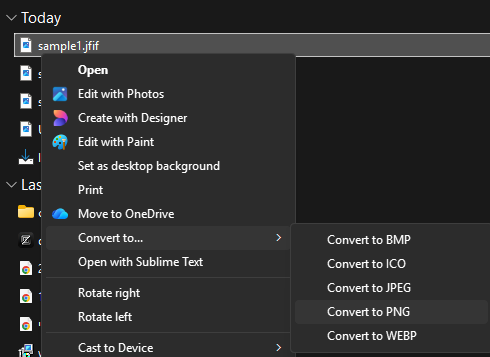
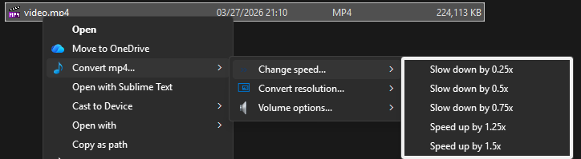
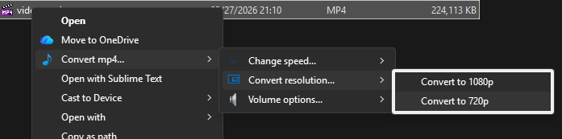
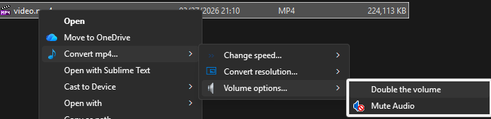

# Context Menu Toolkit

## Basic example

```python title="convert_image_menu.py"
--8<-- "examples/convert_image/apply_menu.py"
```

Looks like:



## More complicated example

```python title="resolution_menu.py"
--8<-- "examples/convert_video/resolution_menu.py"
```

```python title="speed_menu.py"
--8<-- "examples/convert_video/speed_menu.py"
```

```python title="volume_menu.py"
--8<-- "examples/convert_video/volume_menu.py"
```

Then for the finalized menu:

```python title="video_menu.py"
--8<-- "examples/convert_video/video_menu.py"
```

Renders as:




